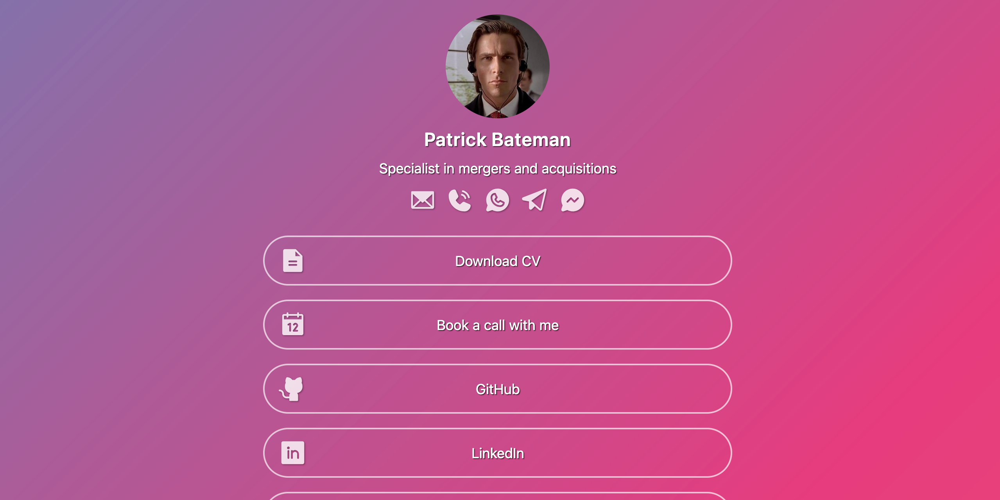

[](https://github.com/morewings/next-card/actions/workflows/pages.yml)

# Next Card

[](#)

Jumpstart your online presence with this pre-built website template. Easily create a professional-looking business card or link-in-bio page to share everything you want your audience to know.

Demo: [GitHub pages](https://morewings.github.io/next-card/)

## Quick start

First step, go to https://github.com/morewings/next-card and click the 'Use this template' button. It will offer you to clone the repository to your account.

Second, change `./next.config.js` to contain your chosen repository name. This is needed for GitHub pages or other non-index page deployment.

```js
/** @type {import('next').NextConfig} */
module.exports = {
    // ...
    basePath: '/your-repository',
};
```

Go to `Settings > Pages` section and enable deployment via GitHub action.


### Fill your info 

Now you'll have to replace `./card-image.jpg` with your picture and enter your data into `./config.ts`.

Here are the available settings:

- `title`: Set your or company name.  

- `bio`: Add a brief description to display below the name.  

- `background`: Select a background style.  There are five different styles available: `fresh`, `strict`, `bold`, `gradient`, `rainbow`. You can also set `random`.

- `cardImage`: Set the image to be used at the header of the card.  

- `gaId`: Set your Google Analytics ID to enable tracking. More later.

- `shareTitle`: Localize the sharing text. 

```ts
export const config: Config = {
    title: 'Patrick Bateman',
    bio: 'Specialist in mergers and acquisitions',
    background: 'gradient',
    cardImage: image,
    // Set your Google Analytics id to enable
    gaId: 'G-XXXXXXXXX',
    // Localise sharing text
    shareTitle: 'Share link',
    // ...
}
```

### Add contact links

In the same file, `./config.ts` fill `headerLinks` array with your contact info links and set up your hero links at the `mainLinks` section of the config.
Each entry consists of `title`: the display name of the link; `id`: a unique identifier for the link; `url`: The URL the link points to; `icon`: an icon to be displayed with the link. You can use any icon from the [Phosphor icons collection](https://phosphoricons.com/).

```ts
import {
    Envelope,
    GithubLogo,
} from '@phosphor-icons/react/dist/ssr';

export const config: Config = {
    // ...
    headerLinks: [
        {
            title: 'Email',
            id: 'email',
            url: 'mailto:user@example.com',
            icon: Envelope,
        },
    ],
    mainLinks: [
        {
            id: 'github',
            title: 'GitHub',
            url: 'https://github.com/user-name',
            icon: GithubLogo,
        },
    ],
}
```

### Deploy website

Commit your changes, push to the main branch and wait until `.github/workflows/pages.yml` is done. Your Next Card is available at `https://<user-name>.github.io/<repo-name>/`. 

## Set up analytics

Next Card supports Google Analytics. You just need to set up your property ID in config. 

There are two custom events to track: `link_click` and `contact_click`. Each event reports link title as a `value` parameter.

## Custom domain

You can [set up a custom domain](https://docs.github.com/en/pages/configuring-a-custom-domain-for-your-github-pages-site) for your card.

Don't forget to remove `basePath` property from the `./next.config.js`.


